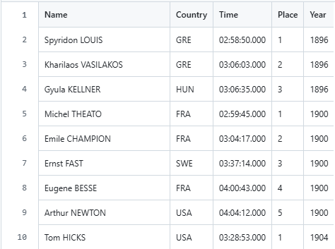
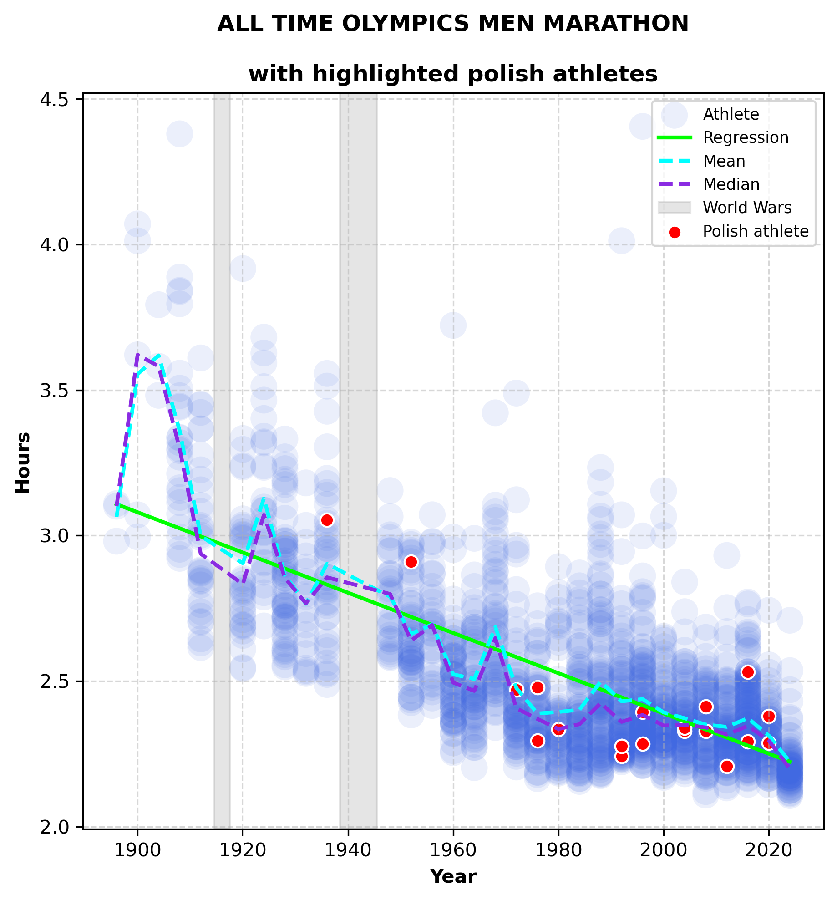

# Olympics Marathon Results 1896–2024
Historical dataset of men's Olympic marathon results (1896–2024), manually compiled from official sources, with visualizations.

## Dataset preview


## Project structure
- [data_raw/](data_raw/) – original text files with raw marathon results  
- [data_clean/](data_clean/) – cleaned CSV datasets ready for analysis  
- [notebooks/](notebooks/) – Jupyter notebooks:
  - [create_clean_data.ipynb](create_clean_data.ipynb) – combines and cleans raw TXT files into a single CSV dataset  
  - [olympics.ipynb](olympics.ipynb) – analysis and visualization of the cleaned dataset  
- [charts/](charts/) – saved plots and visualizations  
- [olympics.pdf](olympics.pdf) – final report with charts

## Example chart with highlighted polish athletes


## Technologies
- Python 3.12  
- pandas  
- matplotlib  
- Jupyter Notebook  

## How to run

### 1. Install required packages
```bash
pip install -r requirements.txt
```
#### Note
The olympics_results.csv is already included in this repository. If you want to generate a clean dataset by yourself, run the create_clean_data.ipynb notebook first.
```bash
jupyter notebook notebooks/create_clean_data.ipynb
```
### 2. Run the visualization notebook
```bash
jupyter notebook notebooks/olympics.ipynb
```


