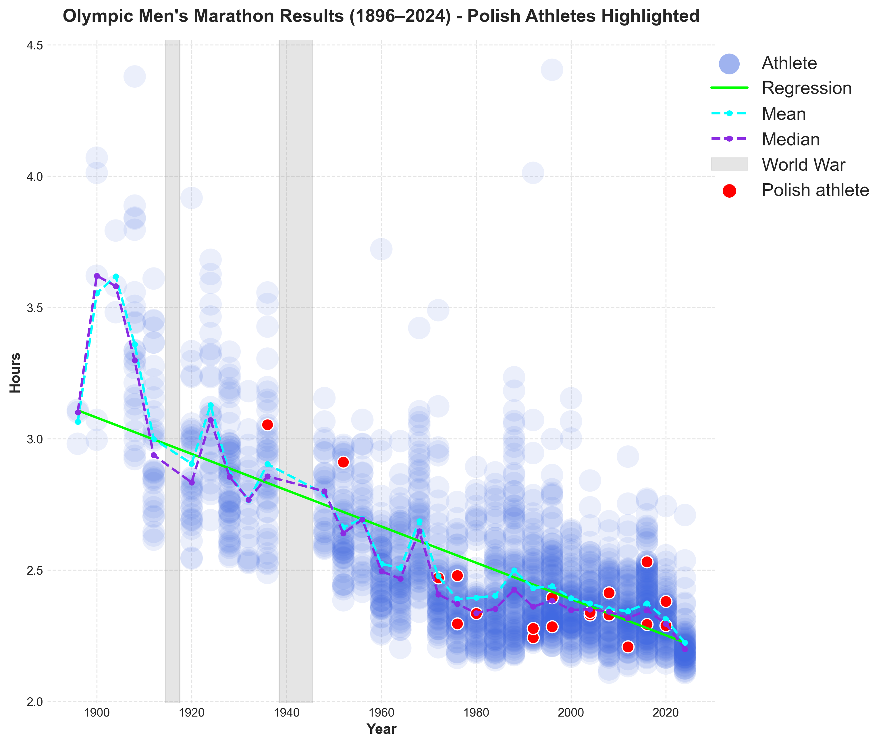

# Olympics Marathon Results 1896–2024
Historical dataset of men's Olympic marathon results (1896–2024) with visualizations.

## Project structure
- `data_raw/` – original text files with raw marathon results  
- `data_clean/` – cleaned CSV datasets ready for analysis  
- `notebooks/` – Jupyter notebooks:
  - `create_clean_data.ipynb` – combines and cleans raw TXT files into a single CSV dataset  
  - `olympics.ipynb` – analysis and visualization of the cleaned dataset  
- `charts/` – saved plots and visualizations  
- `olympics.pdf` – final report with charts

## Example chart with highlighted polish athletes


## Technologies
- Python 3.12  
- pandas  
- matplotlib  
- Jupyter Notebook  

## How to run
```bash
# 1. Install required packages
pip install -r requirements.txt

# 2. Run the data cleaning notebook to generate the clean dataset
jupyter notebook notebooks/create_clean_data.ipynb

# 3. Run the analysis and visualization notebook
jupyter notebook notebooks/olympics.ipynb
